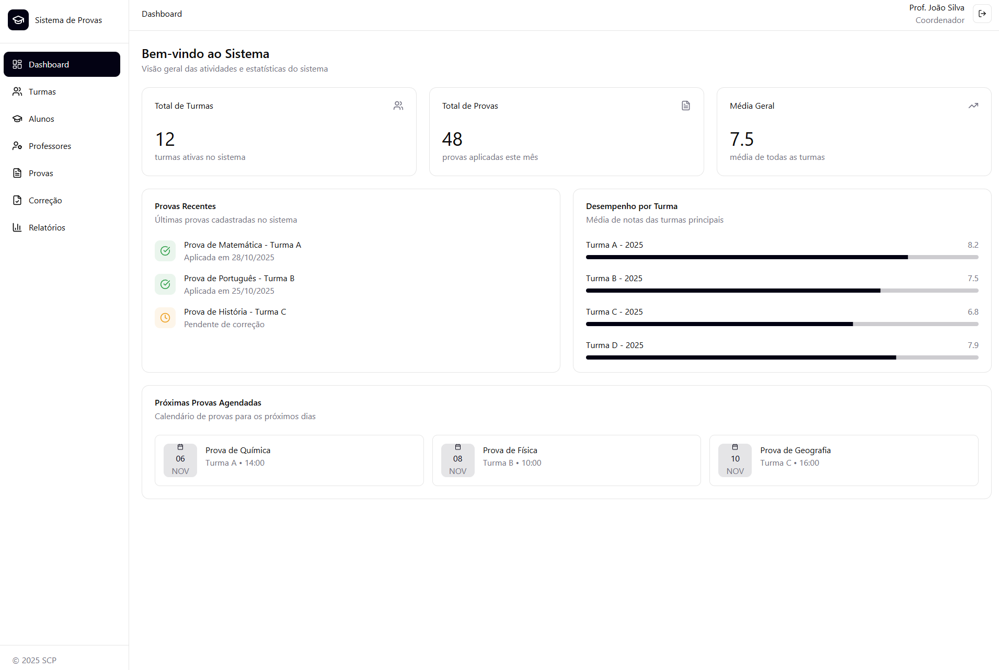

## Sistema de Correção de Provas

## Running the code

  Run `npm i` to install the dependencies.

  Run `npm run dev` to start the development server.


## Requisitos Funcionais

Este documento descreve os **12 requisitos funcionais** do MVP do sistema de correção de provas, ordenados do mais simples ao mais complexo.

---

## 🧩 Requisitos Funcionais

### **RF01 – Cadastro de Turmas**
O sistema deve permitir o cadastro de turmas informando nome, ano letivo e curso.

**Critério de aceite:** a turma cadastrada deve aparecer imediatamente na listagem e estar disponível para vincular alunos e provas.

---

### **RF02 – Edição de Turmas**
O sistema deve permitir ao usuário editar informações de uma turma existente, como nome, ano ou curso.
**Critério de aceite:** as alterações devem ser salvas e refletidas na listagem sem recriar o registro.

---

### **RF03 – Exclusão de Turmas**
O sistema deve permitir a exclusão de turmas que não possuam provas associadas.
**Critério de aceite:** o sistema deve exibir uma mensagem de confirmação e bloquear a exclusão caso existam provas vinculadas.

---

### **RF04 – Cadastro de Alunos**
O sistema deve permitir cadastrar alunos informando nome completo, número de matrícula e turma associada.
**Critério de aceite:** o aluno deve ser exibido na listagem da turma após o salvamento.

---

### **RF05 – Edição de Alunos**
O sistema deve permitir editar dados de alunos (nome, matrícula e turma).
**Critério de aceite:** as alterações devem ser registradas sem duplicar o aluno.

---

### **RF06 – Exclusão de Alunos**
O sistema deve permitir excluir um aluno específico, removendo todos os vínculos de provas e respostas associadas.
**Critério de aceite:** o sistema deve solicitar confirmação e impedir exclusão de aluno com notas registradas, a menos que o usuário seja administrador.

---

### **RF08 – Cadastro de Provas**
O sistema deve permitir criar provas associadas a uma turma, informando título, data de aplicação e número de questões.
**Critério de aceite:** a prova deve aparecer na listagem da turma e permitir o cadastro de gabarito posteriormente.

---

### **RF09 – Edição de Provas**
O sistema deve permitir editar informações de uma prova existente, desde que ainda não tenha sido corrigida.
**Critério de aceite:** alterações devem ser bloqueadas se a prova já tiver notas lançadas.

---

### **RF10 – Exclusão de Provas**
O sistema deve permitir excluir uma prova que ainda não tenha respostas registradas.
**Critério de aceite:** o sistema deve emitir aviso e impedir a exclusão caso existam resultados associados.

---

### **RF11 – Cadastro de Gabarito**
O sistema deve permitir o cadastro de um gabarito para uma prova, informando a alternativa correta de cada questão.
**Critério de aceite:** o sistema deve validar se o número de respostas do gabarito corresponde ao total de questões da prova.

---

### **RF12 – Edição de Gabarito**
O sistema deve permitir alterar o gabarito após o cadastro, com opção de anular questões ou corrigir erros de digitação.
**Critério de aceite:** o sistema deve recalcular as notas automaticamente após alteração.

---

### **RF13 – Cadastro de Respostas dos Alunos**
O sistema deve permitir o registro manual das respostas de cada aluno, apresentando interface em forma de grade com alternativas A–E.
**Critério de aceite:** o sistema deve validar automaticamente o preenchimento completo antes de salvar.



---

## Tecnologias Utilizadas no Sistema de Correção de Provas

### Tecnologias Core

**React 18+**
Framework JavaScript para construção de interfaces de usuário. Utilizamos:
- **Hooks** para gerenciamento de estado
- **Componentes** funcionais para toda a aplicação
- *Composition* de componentes para criar interfaces modulares e reutilizáveis

**TypeScript**
**Superset de JavaScript** que adiciona tipagem estática:
- Interfaces para definir estruturas de dados (Aluno, Turma, Prova, etc.)
- Type safety prevenindo erros em tempo de desenvolvimento
- Autocompletar aprimorado para desenvolvedores
- Tipos personalizados como `Page`, `Prova`, `Resultado`

**Tailwind CSS v4.0**
Framework utilitário-first para estilização:
- Classes utilitárias (`flex`, `grid`, `p-4`, `rounded-lg`)
- Design responsivo com breakpoints (`sm:`, `md:`, `lg:`)
- Suporte a modo escuro (dark mode) com variáveis CSS
- Customização através de `globals.css` com tokens de design

---

### Biblioteca de Componentes

**shadcn/ui**
Coleção de componentes React reutilizáveis e acessíveis, utilizada no sistema:
- Componentes de Layout: `Card`, `Tabs`, `Separator`, `ScrollArea`
- Componentes de Formulário: `Input`, `Select`, `Label`, `Button`, `Checkbox`, `Textarea`
- Componentes de Feedback: `Alert`, `Badge`, `Progress`, `Skeleton`
- Componentes de Navegação: `Dialog` (modais), `Sheet` (sidebar mobile), `Table`

Referência: [shadcn/ui – Build your component library](https://v3.shadcn.com/) :contentReference[oaicite:1]{index=1}

---

### Bibliotecas de Gráficos

**Recharts**
Biblioteca de gráficos React baseada em D3:
- `BarChart` – gráficos de barras (média por turma, acerto por questão)
- `PieChart` – gráfico de pizza (distribuição de notas)
- `ResponsiveContainer` – container responsivo para gráficos
- `CartesianGrid`, `XAxis`, `YAxis`, `Tooltip`, `Legend` – componentes auxiliares do gráfico

Referências: [Recharts official site](https://recharts.org/) :contentReference[oaicite:3]{index=3}

---

### Biblioteca de Ícones

**Lucide React**
Biblioteca de ícones SVG moderna e leve. Utilizamos ícones para:
- Navegação: `LayoutDashboard`, `Users`, `GraduationCap`, `UserCog`, `FileText`, `BarChart3`
- Ações: `Plus`, `Pencil`, `Trash2`, `Upload`, `Download`, `RefreshCw`
- Status: `CheckCircle`, `XCircle`, `AlertCircle`, `Trophy`, `Award`
- Outros: `Menu`, `LogOut`, `FileCheck`, `TrendingUp`, `Target`

---

### Arquitetura e Organização

**Estrutura de Pastas**
/components
/ui – Componentes reutilizáveis (shadcn/ui)
/pages – Páginas da aplicação
/figma – Componentes protegidos do sistema
/styles – Estilos globais e design tokens


**Padrão de Componentes**
- Page Components – cada página = um componente
- Composition Pattern – combinações de componentes pequenos para compor interfaces
- Props Drilling – passagem de props quando necessário
- Estado local – gerenciado com `useState`

---

### Design System

**Tokens CSS (globals.css)**

```
--primary      – Cor primária (azul)
--secondary    – Cor secundária
--success      – Verde (acertos)
--destructive  – Vermelho (erros)
--warning      – Amarelo (avisos)
--info         – Azul informativo
```


**Manipulação de Dados**

```

// Arrays de objetos
const alunos: Aluno[] = [...]

// Records/Maps para lookup rápido
const respostas: Record<number, string[]> = {}

// Funções de transformação
const calcularResultados = () => { ... }

```

**Responsividade**

```
// Grid responsivo
grid grid-cols-1 md:grid-cols-2 lg:grid-cols-4

// Flex condicional
flex-col sm:flex-row

// Visibilidade condicional
hidden md:block
```
